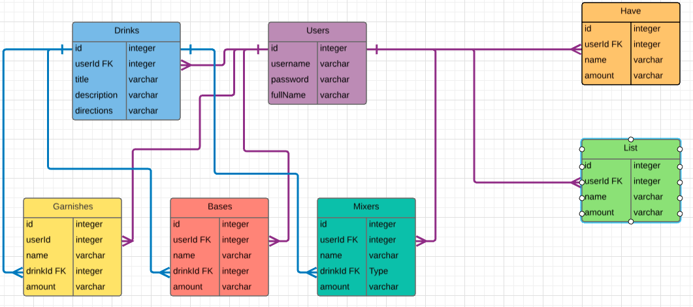

# Welcome to MIX & SIP developed by Kayla Reid
----
## What is the app?

> This is a single page application that allows you to have a virtual recipe list of your favorite mixed drinks!
You are able to add new recipes as you discover them, as well as edit the ones you have as you improve your favorite mixes! You also have the options to delete a mix if you went a little crazy on if and don't think you'll be wanting it again anytime soon! 

----
## Purpose of the app

>  To keep you from forgetting mix amounts or about drinks all together. I like most people like to drink but also like to save money and making drinks at home is way cheeper than going out,  that being said I have a ever growing note on my phone with my favorite drink recipes. The more I collected the more I knew I wanted to build and app that gave me a forum in which to create, store, edit, and delete recipes! 

## My ERD for this project 

---

## How to use my app 
1. Write markdown text in this textarea.
2. Click 'HTML Preview' button.

----

    code (4 spaces indent)
[links](http://wikipedia.org)

----
## changelog
* 17-Feb-2013 re-design

----
## Thanks for checkouting out MIX & SIP
### Checkout my GitHub for other projects
* [https://github.com/KaylaReid](https://github.com/KaylaReid)